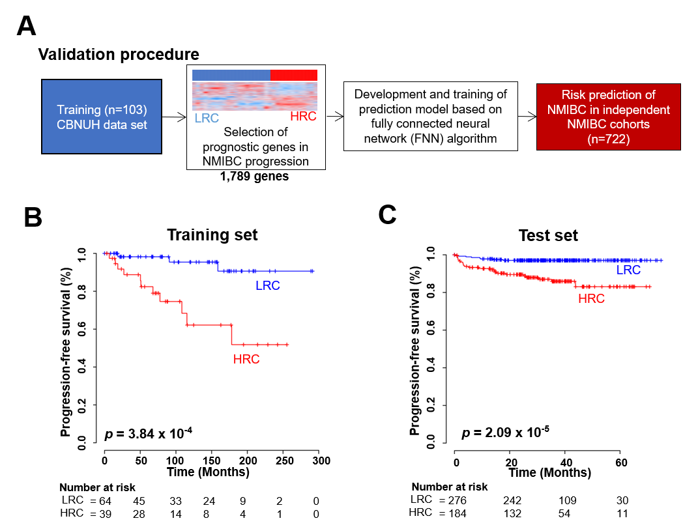

# DPPN: Deep Progression Predictor in NMIBC
### A procedure of training and test of prediction model for non-muscle-invasive bladder cancer (NMIBC) progression

## Abstract
Background: Recent advances in high-throughput technology and data-driven approaches have yielded many insights into non-muscle invasive bladder cancer (NMIBC); however, previous studies have been limited in their ability to predict NMIBC clinical behavior, including response to intravesical therapy. Using a deep learning method and long-term follow-up data, we aim to create a prognostic index (PI) consisting of a small gene group that predicts NMIBC progression and response to intravesical bacillus calmette-guérin (BCG) therapy.

Experimental Design: We used Cox regression analysis to identify progression-associated genes in five independent cohorts of 825 NMIBC patients and validated their predictive values with a fully connected neural network (FNN) algorithm. Using a pathway enrichment analysis on these genes, a PI system consisting of small core genes for NMIBC progression was developed. The relationship between the PI and NMIBC prognosis was evaluated using Kaplan-Meier plots, log-rank tests, and immunohistochemical (IHC) staining.

Results: Gene expression profiling in NMIBC patients revealed a prognostic gene set of 1,789 genes for predicting NMIBC progression in a patient cohort (training set, n = 103). Their prognostic significances were validated in four additional independent cohorts using the FNN algorithm (validation sets, n = 722). Pathway enrichment and IHC analyses revealed a 23-gene signature that included known prognostic transcription factors like FOXM1 and E2F1 as well as novel genes. These genes were incorporated into the PI system, which was a significant prognostic indicator of NMIBC progression. A multivariate analysis and subset stratification based on stage and grade revealed that the PI system was an independent risk factor (HR 4.95, 95% CI=1.54 to 15.885, p=0.007). Additionally, the subset analysis showed that the PI system was capable of identifying patients who would benefit from BCG immunotherapy.

Conclusions: The 23 gene-based PI is a promising diagnostic tool for identifying high-risk NMIBC patients who will exhibit different clinical behaviors and responses to BCG immunotherapy.

The codes in the Python language that describe the training and validation procedures of the prediction model based on FNN algorithm are available in this repository. The entire procedure is described in the Python language and provided as a Jupyter notebook script named DPPN.ipynb.

<b>Figure</b>: Prognostic gene set and progression-free survival (PFS) of two patient clusters (Low-Risk Cluster [LRC] or High-Risk Cluster [HRC]) in non-muscle-invasive bladder cancer (NMIBC). (A) Training and validation strategy for the prediction model based on 1,789 genes. (B) Kaplan-Meier curves show a significantly higher progression rate in HRC patients compared to LRC patients (log-rank test, p<0.001). (C) Kaplan-Meier plots of NMIBC patient progression from the test set, predicted by a fully connected neural network (FNN) algorithm. CBNUH: Chungbuk National University Hospital.

## Descriptions of files in the repository
* <b>DPPN.ipynb</b>: The script containing training and validation procedures can be loaded in the Jupyter notebook environment.
* <b>gex.q_norm.g1789.overlapped_g1205.T.txt</b>: An example of preprocessed gene expression data contains data from the CBNUH cohort (n=103) and the UROMOL cohort (n=476). The data was processed, including expression profiles of 1,789 prognostic genes extracted from the training data.
* <b>PFS_data.TEST_SET.txt</b>: An example of survival status in the test dataset. 

## How to use
To use the code provided in this repository, you should first construct and activate a Conda virtual environment to execute the script.
<pre><code>$> conda create -n [your_vitural_envriment_name]
$> conda activate [your_vitural_envriment_name]
</code></pre>

After activating your virtual environment, you need to install several packages using conda or pip as described below:

<pre><code>$> conda install numpy pandas matplotlib
$> conda install jupyter notebook
$> conda install scikit-learn
$> pip install keras
$> pip install tensorflow
$> pip install sklearn lifelines
</code></pre>

After installing the packages described above, you can confirm their status using the following command:

<pre><code>$> conda list</code></pre>

Now, You can import all the meterials in the repository, then execute the script, DPPN.ipynb. Please follow the step-by-step guides as describe in DPPN.ipynb.